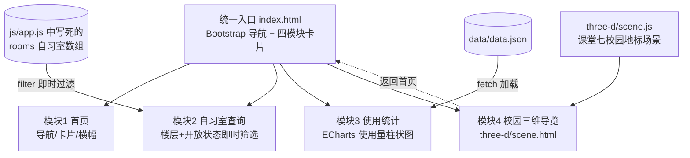

# 迷你版校园公共信息与数据展示中心

期末大作业原型（个人技术整合练习）。把课堂作业五（筛选交互）、作业六（数据看板/ECharts）、作业七（Three.js 三维场景）复制进 `integration/` 统一改造，形成「一个入口、一条数据主线、四个模块」的个人作品原型。

- 远程仓库：<https://github.com/20251060233/frontend-practice>
- 原型目录：仓库下 `integration/`
- 主题：校园公共信息与数据展示（蓝色系校园风格，延续课堂看板 + 三维主题）

## 一、模块与结构图



**模块间衔接（不是四个孤立页面）**：

1. **统一入口与导航**：四个模块共用同一个顶部导航（首页锚点 + 三维独立页），首页四张卡片分别进入各模块；三维页有「返回首页」。
2. **主题衔接**：全部页面共用同一套蓝色系视觉（导航渐变、卡片描边、状态色），三维场景中的主教学楼/校门与自习室、使用数据同属"校园"语境。
3. **数据衔接**：自习室列表（8 间）与 `data.json` 柱状图（8 条记录）一一同名（第一自习室、第二自习室……电子阅览室），筛选看到的房间就是图表统计的房间。

## 二、目录结构

```text
integration/
├─ index.html              # 统一入口：导航 + 卡片 + 自习室区块 + 统计区块 + 三维入口
├─ css/style.css           # 自定义样式（含三档响应式与状态提示）
├─ js/app.js               # 自习室筛选 + fetch/ECharts 图表
├─ data/
│  ├─ data.json            # 各自习室月度使用量（正常数据）
│  └─ data.empty.json      # 空数据自测样本
├─ three-d/
│  ├─ scene.html           # 校园三维导览页（可返回首页）
│  ├─ scene.js             # Three.js 场景（含 WebGL 不可用降级）
│  └─ libs/                # three.min.js、OrbitControls.js（本地副本）
├─ libs/                   # bootstrap.min.css / bootstrap.bundle.min.js / echarts.min.js（本地副本）
├─ screenshots/            # 质量自查截图证据
└─ docs/                   # 质量清单、同伴审查、轮值记录、期末实施计划
```

## 三、运行说明

所有第三方库均为**本地副本**，运行时不依赖 CDN；但图表用 `fetch` 读取 JSON，浏览器安全策略下直接双击打开（`file://`）会触发断网提示，因此请用本地静态服务器：

```bash
# 进入原型目录
cd integration

# 方式一：Python（课堂环境已安装 Anaconda3）
python -m http.server 8787

# 方式二：任意静态服务器均可，如 VS Code 的 Live Server
```

浏览器访问 <http://localhost:8787/index.html>。

自测地址：

- 空数据状态：<http://localhost:8787/index.html?data=data/data.empty.json>
- 三维导览：<http://localhost:8787/three-d/scene.html>

## 四、质量自查（四项必查）

| 项目 | 结论 | 证据 |
| --- | --- | --- |
| 三档宽度 1280 / 768 / 375 | 通过（4列→2列→单列，导航自动折叠） | screenshots/01~03 |
| 断网提示（file:// 打开） | 通过（样式正常，统计区红色提示条） | screenshots/04 |
| Console 无报错 | 通过（错误 0、警告 0，附功能探针） | screenshots/05 |
| 空数据 | 通过（琥珀色中性提示，不与断网混淆） | screenshots/07 |

详细记录见 [docs/quality-checklist.md](docs/quality-checklist.md)。

## 五、资源来源说明

| 资源 | 版本 | 来源 | 使用方式 |
| --- | --- | --- | --- |
| Bootstrap | 5.3.3 | 课堂作业六留存的本地副本（官网 <https://getbootstrap.com>） | libs/ 本地引用，离线可用 |
| ECharts | 5.6.0 | 课堂作业六留存的本地副本（官网 <https://echarts.apache.org>） | libs/ 本地引用 |
| Three.js + OrbitControls | 课堂七沿用版本 | 课堂作业七留存的本地副本（官网 <https://threejs.org>） | three-d/libs/ 本地引用 |
| 三维场景模型 | — | 本人课堂七 `three-d/showcase.js` 代码建模（几何体组合，无外部模型/贴图） | 复制改造为 three-d/scene.js |
| 统计数据 | — | 本人编写的示例数据，`source` 字段已标注"示例数据" | data/data.json |
| 字体 | — | 系统字体栈（Microsoft YaHei / PingFang SC / sans-serif） | 未使用任何网络字体或网络图片 |

本作品运行时**不发起任何外部网络请求**，无第三方图片、字体、图标 CDN 依赖。

## 六、过程文档

- [docs/quality-checklist.md](docs/quality-checklist.md)：质量清单自查记录
- [docs/peer-review.md](docs/peer-review.md)：同伴审查意见与逐条处理记录
- [docs/coordination-record.md](docs/coordination-record.md)：轮值协调记录
- [docs/final-project-plan.md](docs/final-project-plan.md)：期末大作业实施计划初稿（任务分解/时间表/风险清单）

## 七、Git 提交记录（本原型）

1. 搭建整合骨架：Bootstrap 响应式导航 + 首页四模块卡片与区块占位
2. 交互与图表：楼层/开放状态即时筛选 + ECharts 柱状图（标题/单位/数据来源/断网提示）
3. 三维区与自查证据：three-d/scene.html 搬入课堂七场景 + 三档宽度/断网/三维截图
4. 同伴审查意见处理：重置筛选、空数据提示、WebGL 降级、手机端字号
5. 质量自查补全与过程文档：空数据/Console 证据、质量清单、同伴审查、轮值记录
6. README：结构图、运行说明与资源来源说明
